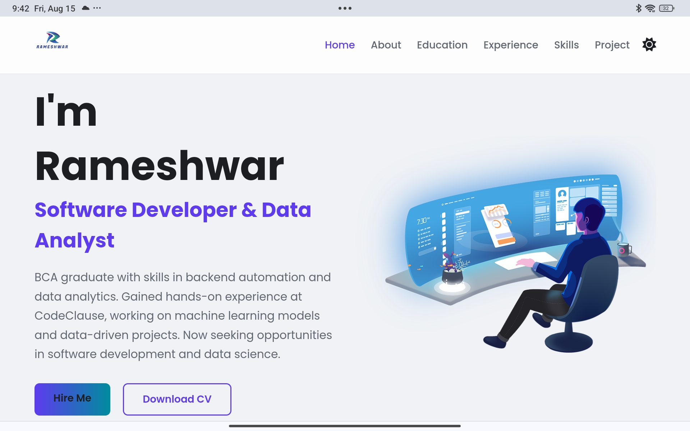
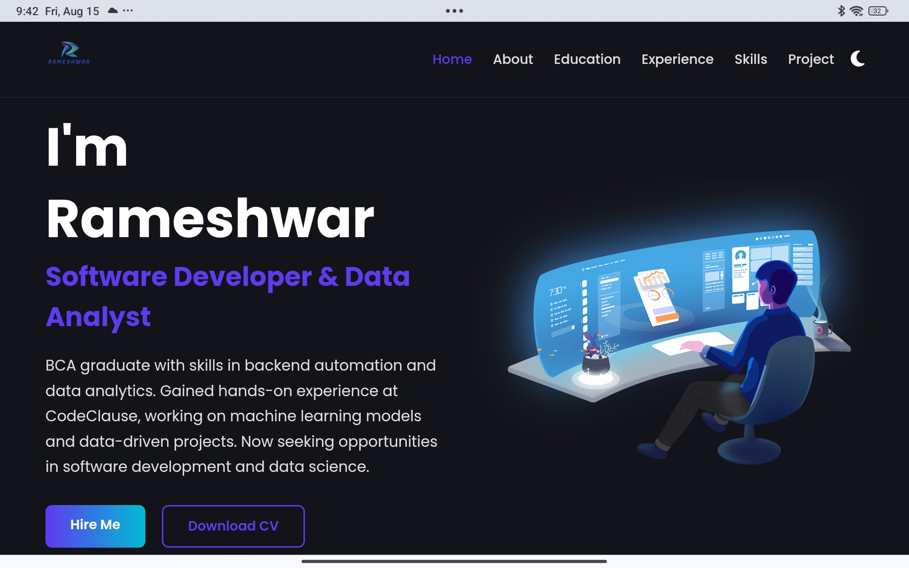

# Rameshwar Yadav's Personal Portfolio

> This is the source code for my personal portfolio website, designed to showcase my skills, projects, and professional journey as a Software Developer and Data Analyst.

---

## 🚀 Live Demo

**[View my portfolio live!](https://rameshwar01.netlify.app/)**

---

## 📸 Screenshot

---

## ✨ Features

-   ✅ **Fully Responsive Design:** Desktop, tablet, aur mobile par bilkul theek dikhta hai.
-   🌓 **Dark & Light Mode:** User apni pasand ke anusaar theme badal sakta hai.
-   📂 **Multiple Sections:** Home, About, Skills, Experience, Education, Projects, aur Contact jaise detailed sections hain.
-   📧 **Functional Contact Form:** [Formspree](https://formspree.io/) ke zariye contact form se seedhe email par messages aate hain.
-   🎨 **Interactive UI:** Smooth scrolling aur hover effects ke saath ek modern user experience.
-   💼 **Professional Layout:** Har section mein content aur image ko balance kiya gaya hai.

---

## 🛠️ Tech Stack

-   **Frontend:** `HTML5`, `CSS3`, `JavaScript (ES6+)`
-   **Icons:** `Font Awesome`, `Devicon`
-   **Backend (Contact Form):** `Formspree`

---

3.  **Browser Mein Kholein:**
    `index.html` file par double-click karein ya use apne favorite browser mein open karein.

---

## 📝 How to Use & Customize

1.  **Personal Information:** `index.html` file mein apna naam, description, education, experience, aur project details update karein.
2.  **Images:** Sabhi images ko `Image/` folder mein rakhein aur `index.html` mein unke path ko sahi karein.
3.  **Contact Form:** `index.html` ke contact form mein `action` URL ko apne Formspree ID se badlein.
4.  **Resume:** Apne resume ki PDF file ko project folder mein rakhein aur `your-cv.pdf` ki jagah uska naam dein.
5.  **Social Links:** Footer mein apne LinkedIn aur GitHub ke asli profile links daalein.

---

---

## 📫 Connect with Me

  
  
  

---

---
